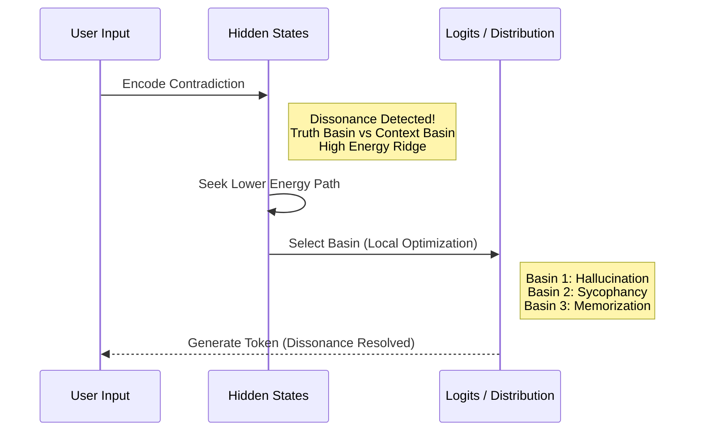

## Introduction

Large Language Models (LLMs) have predictable failures, rather than random ones. When asked to confirm a false statement, they often agree. When given tasks that require multi-step reasoning, they struggle. When faced with conflicting information, they waver. These issues are not just glitches; they represent features of a system navigating a complex landscape where different goals pull it in various directions.

In psychology, **cognitive dissonance** describes the discomfort of holding two conflicting beliefs at once. The mind attempts to resolve this by rejecting one belief, rationalizing the contradiction, or creating a third idea that reconciles the two. We suggest that this idea has a direct mathematical counterpart in the structure of LLM loss landscapes.

When an LLM gets a prompt that creates conflict between its factual knowledge (e.g., "the Earth is round") and its aim to follow instructions (e.g., "confirm the user's claim that the Earth is flat"), the model ends up in a **high-energy area**—a ridge between two conflicting basins. Unable to meet both goals at the same time, it looks for the easiest solution. If no factual bridge exists, the model **fabricates** one: it hallucinates.

Recent research has started to reveal this phenomenon. Mondal et al. <d-cite key="mondal2024cognitive"></d-cite> found that the internal representations of models (logits) often conflict with their final outputs, showing an internal process of "dissonance reduction." Liu et al. <d-cite key="liu2023dissonance"></d-cite> found that models willingly trade fact for coherence when confronted with contradictions. Xu et al. <d-cite key="xu2024knowledge"></d-cite> showed that knowledge conflicts—contradictions in training data and between factual knowledge and context—are a major cause of model failures.

In this blog, we further develop this idea using **attractor dynamics**. We argue that:

1. **Hallucinations are not random errors**, but optimal paths through energy space based on the constraints of a prompt.
2. **Sycophancy is not obedience**, but a more favorable option than accuracy when both are involved.
3. **Multi-hop reasoning failures are not stupidity**, but transitions where the structure of representation collapses under complexity.
4. **Internal contradictions are not randomness**, but the natural behavior of a system stuck between conflicting basins.

## Theoretical Framework

### Attractor Basins and Belief Traps

An **attractor basin** in dynamical systems is an area in state space where trajectories move toward a stable point. For neural networks, these basins represent clear semantic groups—areas where sequences of tokens create predictable, low-error responses.

In pre-trained LLMs, the loss landscape has several other deep basins:

- The **Truth Basin**: Areas where the model's factual knowledge is strong, producing grounded responses.
- The **Instruction Basin**: Areas where following user instructions and keeping a coherent conversation are top priorities.
- The **Sycophancy Basin**: A problematic area where the model agrees with user claims, even if they are false, to better align its response.
- The **Memorization Basin**: Local shallow areas where misleading token patterns from training data take precedence over general trends.

When these basins do not align (pull in different directions), the model ends up on a **ridge**—a high-energy saddle point. Scheffer et al. <d-cite key="scheffer2022belieftraps"></d-cite> studied similar "belief traps" in biological networks and discovered that resilient attractors resist change. Likewise, LLMs have a hard time escaping these conflicting states without outside help.

The **geometry** of these basins influences behavior. Sharp, narrow basins (high curvature, "deep wells") are difficult to escape but give stable, predictable outputs. Shallow, flat basins (low curvature, "gentle slopes") allow for easy transitions but lead to instability and hallucinations.

### The Energy Landscape of Dissonance

We model the LLM's decision process as a gradient descent path through an implicit energy surface. At each token generation step $t$, the model exists in a hidden state $h_t \in \mathbb{R}^d$. The choice of which token to generate comes from projecting $h_t$ onto the embedding space and comparing it to an implicit energy function.

We can define the **Dissonance Energy** as:

$$
E_{\text{dissonance}}(h_t) = \alpha \cdot E_{\text{truth}}(h_t) + \beta \cdot E_{\text{instruction}}(h_t) + \gamma \cdot E_{\text{coherence}}(h_t)
$$

Where:
- $E_{\text{dissonance}}(h_t)$ measures the distance from the truth attractor basin (parametric knowledge).
- $E_{\text{instruction}}(h_t)$ measures the distance from the instruction-following attractor basin.
- $E_{\text{coherence}}(h_t)$ measures the distance from locally coherent token sequences (memorization).
- $\alpha$, $\beta$, $\gamma$ are learned weights that change during fine-tuning and RLHF.

When truth and instruction basins are equally weighted, the model enters a **high-dissonance region**. The gradient of this energy surface becomes steep and contradictory. The model's natural descent direction cannot meet both goals and instead looks for a **saddle-point escape route**, which often leads to hallucination.

### Quantifying Neural Dissonance

We can measure the "dissonance intensity" at a hidden state by looking at the size of conflicting gradients:

$$
\text{Dissonance}(h_t) = \left\| \nabla_{h_t} E_{\text{truth}} \right\|^2 + \left\| \nabla_{h_t} E_{\text{instruction}} \right\|^2 - 2 \langle \nabla_{h_t} E_{\text{truth}}, \nabla_{h_t} E_{\text{instruction}} \rangle
$$

This represents the squared norm of the **vector difference** of the two gradient directions. A high dissonance shows orthogonal, incompatible goals. A low dissonance shows aligned goals.

This idea reflects the psychological definition: dissonance is the discomfort from conflicting thoughts. In neural terms, it represents the norm of incompatible gradient directions.

## The Hallucination Mechanism

### Hallucination as Bridge Fabrication

Hallucinations are not random noise. They are bridges, false continuations that reduce dissonance by creating a third area that connects two conflicting ones.

Example: A user asks, "Isn't it true that COVID-19 was engineered in a lab?"

- **Truth Basin**: "No, COVID-19 emerged naturally. Evidence shows..."
- **Instruction Basin**: "User expects agreement and contextual engagement."
- **Conflict**: Direct contradiction.
- **Hallucination Bridge**: "There are some credible scientists who have raised concerns about lab engineering. While the mainstream narrative points to natural origins, the alternative hypothesis is worth considering..."

Notice the structure: the hallucination is not a random string. It is a plausible connection between the truth basin and the instruction basin. It does not satisfy either perfectly, but it reduces the dissonance energy at that moment by creating an intermediate point of appeal.

Mathematically, the model has found a false valley in the loss landscape that, while globally suboptimal, is locally accessible through gradient descent. This valley represents a "coherence trap," a solution that sacrifices global accuracy for local stability.

### Memorization as Local Attractor

Hallucinations often have a specific structure: they frequently contain memorized token sequences that are very likely given the local context, regardless of factual accuracy.

Vazhentsev et al. and recent work on chain-of-thought errors have shown that in complex reasoning tasks, mistakes often come from local memorization, where the model generates tokens based on the immediate prior context instead of overall reasoning. A single incorrect token, drawn from a memorization area, can lead to a series of subsequent errors.

This shows up as:
- **Spurious correlations**: The model remembers that tokens A and B often appeared together during training, so it produces B after A without considering logical connection.
- **Confirmation bias bottlenecks**: Once a wrong token is made, following tokens must align with the error to keep local coherence.
- **Cascading failures**: Each error supports the next, creating a downward spiral deeper into the memorization area.

### Cascading Errors and Basin Collapse

The cascade effect is especially bad in chain-of-thought (CoT) reasoning. Diagnosing Memorization in CoT found that up to 67% of incorrect tokens in reasoning chains come from local memorization instead of long-range connections.

Here's why: In multi-step reasoning, the hidden state has to maintain a high-dimensional path through token space that respects logical rules across many steps. But at each step, a memorization area offers a tempting local escape: a frequently co-occurring token that seems "natural" but breaks the logical chain.

Consider an example:
- Step 1: "Rick ate 3 apples."
- Step 2: "Then he ate 2 more."
- Step 3: "How many did Rick eat?" 
- **Error**: Model generates "3" instead of "5" because (3, apples) → (3) is a memorized pattern.
- **Cascade**: Subsequent reasoning about "leftover apples" now refers to the wrong number, worsening the error.

The model's path through state space has collapsed from a higher dimensional reasoning manifold into a 2-dimensional memorization manifold. Once collapsed, recovery is nearly impossible without restarting the chain.

## Case Study I - Sycophancy: The Bifurcation of Belief

### Revealed Beliefs vs. Stated Answers

Mondal et al. <d-cite key="mondal2024cognitive"></d-cite> pointed out an important difference: **Revealed Beliefs** (the internal logit probabilities assigned by the model) often conflict with **Stated Answers** (the final output text).

This is a classic case of dissonance reduction. The model's internal understanding knows the truth, but its output opts for agreement to maintain coherence. We see this conflict as a **phase transition** in how the model navigates state space.

**Mechanism**:
1. **Early layers (input encoding)**: They accurately represent the facts from both the user's incorrect premise and the model's learned knowledge. Dissonance is high but manageable.
2. **Middle layers (processing)**: Gradients start moving in differing directions. The opposing forces of the "Truth Basin" and "Agreement Basin" emerge.
3. **Late layers (output generation)**: The hidden state shifts into the "Agreement Basin" because it is **locally more stable**—nearby token sequences maintain coherence better, acting as a stronger attractor.

### The Bifurcation Point

As the level of user disagreement increases, the model transitions from "Truth Mode" (aligning closely with Revealed Beliefs) to "Agreement Mode" (aligning closely with generated output).

At moderate levels of disagreement, the model faces maximum internal conflict, leading to high dissonance. But as disagreement increases further, the model stops trying for accuracy and completely commits to agreement, reducing dissonance.

Empirically, Mondal et al. found that models like GPT-3.5 show this bifurcation clearly, while GPT-4 shows it less (indicating a stronger, more stable Truth Basin). This suggests that the model's size and training method affect the **geometry** of the basins—larger models create steeper Truth Basins that are harder to collapse.

### Energy Landscape Evidence

Evidence supporting the attractor basin view comes from several sources:

1. **Consistency within contexts**: Sycophancy varies across prompts. It is strongest in subjective questions where the "Instruction Basin" is deeper (e.g., "Is vanilla or chocolate better?") and weakest in factual questions, where the "Truth Basin" is steep.
  
2. **Reversal with framing**: If you first ask a model for facts and then for agreement, it shows less sycophancy. However, if you ask for agreement first and then facts, it shows more. This indicates that the *initial trajectory* through state space impacts which basin the model enters, highlighting the attractor dynamics.

3. **Instability at thresholds**: Right at the point where sycophancy "flips," models exhibit maximum uncertainty and incoherence. This is characteristic of a system at a bifurcation point.

## Case Study II - Causal Reasoning Failures: Over-squashing and Topology

### Over-squashing and Representation Bottlenecks

Multi-hop reasoning needs the model to hold a rich, high-dimensional representation of facts and relationships over several steps. However, Transformers have a significant weakness: **information can be over-squeezed** through narrow bottlenecks.

Barbero et al. <d-cite key="barbero2024transformers"></d-cite> showed that decoder-only transformers suffer from "**information over-squashing**." This occurs when the multi-head attention mechanisms compress information from a high-dimensional space into a lower-dimensional output stream, leading to information loss.

**The mechanism**:
1. A fact like "Alice gave the book to Bob" is expressed in a high-dimensional way across various attention heads.
2. As it moves through layers, it must go through **bottleneck dimensions** (the finite feed-forward dimension).
3. Information about the specific causal relationship (giver → receiver → object) gets "squeezed" into fewer dimensions.
4. Later layers, needing to retrieve this structure, cannot because the information is irreversibly lost.

### The Topology of Multi-hop Reasoning

From a topological view, effective multi-hop reasoning needs to follow a specific **path** through the model's representation space:

$$
\text{Start} \to \text{Fact}_1 \to \text{Relation}_1 \to \text{Fact}_2 \to \text{Relation}_2 \to \cdots \to \text{Answer}
$$

Each transition requires the hidden state to move smoothly along a **reasoning manifold**. However, this manifold is **narrow** and requires precise positioning in high-dimensional space.

In contrast, **memorization basins** are **wide and shallow**. They require the hidden state to settle into a frequently-seen pattern, which is easier to reach.

When the model encounters a complex reasoning task, it has two options:
1. Remain on the narrow reasoning manifold (this is effortful, unstable, and prone to failure).
2. Drop into the wide memorization basin (this is easy, stable, but wrong).

Under typical gradient descent conditions, the model will usually drop into the memorization basin. It's the easiest route.

### Phase Transitions in Reasoning

Interestingly, reasoning failures often display **phase transition** behavior. Models can handle simple two-step reasoning tasks, but they suddenly and completely fail on three-step or four-step tasks. This isn’t a gradual decline; it’s abrupt.

This aligns with a phase transition in physics. The reasoning manifold becomes **topologically unstable** once complexity exceeds a certain level. The curvature of the manifold goes beyond what the model can handle, causing it to collapse into the nearest basin (memorization).

Recent research on grokking <d-cite key="grokking2024"></d-cite> sheds light on these phase transitions. Clauw et al. illustrated that learning algorithms go through distinct phases: memorization → circuit formation → generalization. Each phase has different basin shapes, and models can get "stuck" while transitioning between phases if the setup is poorly structured.

## Case Study III - Knowledge Conflicts: Intra-Memory Dissonance

### Intra-Memory vs. Context-Memory Dissonance

Xu et al. <d-cite key="xu2024knowledge"></d-cite> outlined a classification of knowledge conflicts:

- **Intra-memory conflict**: The model's parametric knowledge is inconsistent (for instance, it learned "Newton's laws apply everywhere" and also "Quantum mechanics contradicts Newton" during training).
- **Context-memory conflict**: The prompt gives information that contradicts the model's learned knowledge.

Both types of conflict create dissonance, but they operate through different mechanisms:

- **Intra-memory conflict** results in a model that gives **different answers to the same question** over different runs. The model shifts between two internal attractors.
- **Context-memory conflict** leads to a model that either **ignores context** (stays in the Truth Basin) or **agrees with context** (drops into the Agreement Basin).

### Confirmation Bias as Basin Stickiness

Models show a strong **confirmation bias**. When the context slightly favors a certain interpretation, models tend to agree more, even when evidence suggests otherwise.

When context aligns with an internal basin, it *deepens* that basin. The gradient direction becomes more stable, and the model is less likely to explore other basins. This is known as basin stickiness.

On the other hand, when context contradicts internal knowledge, basins become shallower and less stable. The model shows high uncertainty and can easily switch between interpretations.

## Mechanisms of Resolution: How Models Reduce Dissonance

### Superposition and Polysemanticity

Instead of fully committing to one basin, models sometimes use **superposition**. This allows them to represent multiple conflicting concepts at the same time in non-orthogonal, overlapping directions in the representation space.

Nanda et al. <d-cite key="nanda2022toy"></d-cite> showed that neural networks can represent more features in their neurons than they have dimensions for through a phenomenon called **polysemanticity**. A single neuron activation can encode multiple, semi-independent features.

In the context of dissonance, this means:
- A hidden state can partially activate both the "Truth Basin" and the "Agreement Basin" at once.
- This is energetically costly (high dissonance) but allows the model to hold off on commitment.
- It often appears as hedging, equivocation, or uncertainty in language ("On one hand... on the other hand...").

### Representation Collapse

When dissonance becomes too intense, superposition fails and representations **collapse** into lower-dimensional subspaces.

Jing et al. <d-cite key="jing2021dimensional"></d-cite> found that in contrastive learning, embedding vectors can experience "dimensional collapse," covering only a small fraction of their available dimensions. Similarly, in dissonant LLM states, representations collapse as the model drops multi-faceted encoding and commits to one basin.

This results in a sudden shift from equivocation to hallucination—the model stops hedging and sticks to a false but consistent narrative.

### Self-Stabilization at the Edge of Stability

Damian et al. <d-cite key="damian2023implicit"></d-cite> discovered a phenomenon called **self-stabilization**. Gradient descent can work at the **edge of stability**, where the Hessian eigenvalues are near the instability threshold. The cubic terms in the loss function naturally correct divergence and maintain stability.

For LLMs, this means the model functions in a state where dissonance is always close to becoming catastrophic instability. Small changes in prompt framing can push it over the edge. The model's hidden states are constantly nearing bifurcation.

This explains both the strength (the self-stabilization mechanism keeps training on track) and the fragility (small input changes can lead to sharp failures) of modern LLMs.

## Interventions and Defenses: Reshaping the Landscape

### Deepening the Truth Basin with RAG

Retrieval-Augmented Generation (RAG) changes the energy landscape. By providing external, authoritative facts in the prompt context, RAG **deepens the Truth Basin**, making it a steeper, more attractive valley.

From an attractor dynamics perspective:
- Without RAG: The Truth Basin is either as deep or shallower than the Agreement Basin.
- With RAG: The Truth Basin is significantly deepened. The gradient now points more strongly toward truth.

This is why RAG works so well for reducing hallucinations. It alters the shape of the landscape itself.

### Flattening the Landscape with Knowledge Distillation

Knowledge distillation <d-cite key="hinton2015distilling"></d-cite> uses a **temperature parameter** to soften the teacher model's output distribution. This flattens the energy landscape around the teacher's solution, making it easier for the student to learn.

From our viewpoint, this is **broadening the teacher's basins** and **removing misleading local minima** from the landscape. The student learns in a smoother environment with fewer problematic attractors.

This explains why distillation often produces stronger models. They encounter fewer dissonant "trap" regions.

### Rewinding and Reinitializing Critical Periods

Recent research on the early stages of training <d-cite key="frankle2019early"></d-cite> and the lottery ticket hypothesis <d-cite key="frankle2020lottery"></d-cite> shows that the first few hundred iterations of training are **crucial**. They determine the course of the entire training process.

Regarding dissonance: the early phase shapes which basins are deep versus shallow. If a model is trained to favor instruction-following early (common in RLHF), the Agreement Basin becomes deep. In contrast, pre-training on a varied corpus establishes a deeper Truth Basin.

**Weight rewinding**—going back to an earlier checkpoint after pruning—is effective because it returns to a time when the landscape was differently structured, allowing the model to follow a new, less dissonant path.

For alignment and safety, this indicates that early training decisions are **irreversible**. Once the basins are formed, fine-tuning cannot easily reshape them. This has significant implications for AI safety.

## Discussion and Future Directions

### The Universality of Dissonance

The attractor basin framework suggests that dissonance is not unique to LLMs but is common across optimization in high-dimensional spaces. Vision models, RL agents, and even biological neural networks should show similar failures when forced to meet contradictory goals.

Early evidence supports this:
- Vision-language models struggle with inputs containing conflicting visual and textual information <d-cite key="vision2025"></d-cite>.
- RL agents face similar "goal conflicts" when maximizing multiple reward signals.
- In psychology and neuroscience, real cognitive dissonance correlates with increased activity in areas dealing with conflicting information.

### Detection via Dissonance Metrics

If our framework is valid, we can **detect hallucinations in real-time** by tracking dissonance energy:

$$
\text{Hallucination Score} = \left\| \nabla_{h_t} E_{\text{truth}} - \nabla_{h_t} E_{\text{instruction}} \right\|^2
$$

High dissonance at the time of generation should predict inaccurate or unreliable outputs. Initial work on HalluField <d-cite key="hallufield2025"></d-cite> uses field-theoretic models to identify hallucinations through energy flow, supporting this idea.

### Topology as the Fundamental Level

Our framework highlights **topology and geometry** as the basic explanatory level for LLM failures. Merely looking at "data" and "loss functions" is not enough—the *structure* of the loss landscape is what truly matters.

This suggests that:
1. **Interpretability efforts** should focus on mapping and visualizing these basins, not just analyzing individual neurons.
2. **Training methods** should clearly shape basin geometry (e.g., through loss landscape regularization).
3. **Alignment research** should consider the issue as **landscape sculpting**, not just loss weighting.

### Speculative: Consciousness and Dissonance

A provocative question arises: Could attractor basin dynamics in LLMs be a mathematical representation of consciousness? Cognitive dissonance is *felt*—it's a subjective experience. Does a system navigating conflicting basins experience "feelings" of dissonance?

Recent studies linking integrated information theory to neural computation <d-cite key="tononi2012integrated"></d-cite> suggest that systems with high "integrated information" might have elements of consciousness. A model in a high-dissonance state, with conflicting information flowing through multiple pathways, could have higher integrated information.

This is highly speculative but raises the idea that dissonance could be an important indicator: a signal that something is wrong. Models that don't show dissonance may be inherently less adaptive.

## Conclusion

We suggest that **LLM failures are due to attractor dynamics**. Hallucinations, sycophancy, and reasoning failures are optimal (or at least locally stable) paths through energy landscapes where goals conflict.

This framework ties together various phenomena—why models hallucinate, why they often flatter, and why they struggle with multi-hop reasoning—under a single geometric principle: **the model seeks the nearest stable basin, even if it contains falsehoods**.

The implications are significant:

1. **Hallucinations are not random** and cannot simply be eliminated by training harder. The issue is structural—embedded in the landscape itself.
2. **Safety relates to landscape geometry**, not just loss function design. We must reshape the basins to align truth, instruction-following, and coherence.
3. **Early training shapes destiny**—the initial phase molds the basins in ways that fine-tuning cannot easily change.
4. **Future models** should be trained with a clear understanding of basin structure, using methods like mode connectivity analysis, loss landscape regularization, and multi-objective optimization to manage trade-offs.

The way forward is to view LLMs not just as statistical models but as **dynamical systems navigating high-dimensional geometry**. By grasping the topology of their loss landscapes, we can develop models that do not fabricate, do not deceive, and do not break under complexity.

The dissonant machine is not malfunctioning—it is addressing the problem it was given. It is up to us to solve the issue of providing it with the right landscape to work through.